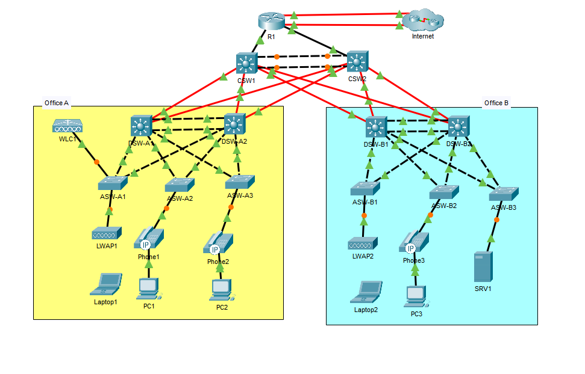

# CCNA Mega Lab – Enterprise Network Simulation

This project simulates a multi-site enterprise network using industry-standard design principles, redundancy mechanisms, and Layer 2/Layer 3 technologies.

It demonstrates not only configuration skills, but also network design, validation, and troubleshooting methodology.

---

## 🏗️ Architecture Overview

- Multi-site topology (Office A / Office B)
- Hierarchical design:
  - Core Layer
  - Distribution Layer
  - Access Layer
- Redundant links across all layers
- Wireless + wired integration

---

## 🌐 Topology

---

## 🚀 Key Technologies

- VLAN segmentation
- 802.1Q trunking
- EtherChannel (LACP + PAgP)
- VTP (centralized VLAN management)
- Rapid STP (RSTP)
- Inter-VLAN routing (future phases)
- First Hop Redundancy (HSRP – future)

---

## 📁 Project Structure

- `configs/` → Device configurations  
- `design/` → Network design decisions and architecture  
- `verification/` → Validation and troubleshooting outputs  
- `topology/` → Network diagrams  

---

## 🎯 Key Engineering Focus

- Eliminating single points of failure
- Standardizing configurations across devices
- Segmenting traffic for scalability and security
- Validating network behavior using operational commands

---

## 📌 Notes

This project is based on Jeremy’s IT Lab Mega Lab, but extended with structured documentation and engineering-focused validation.
